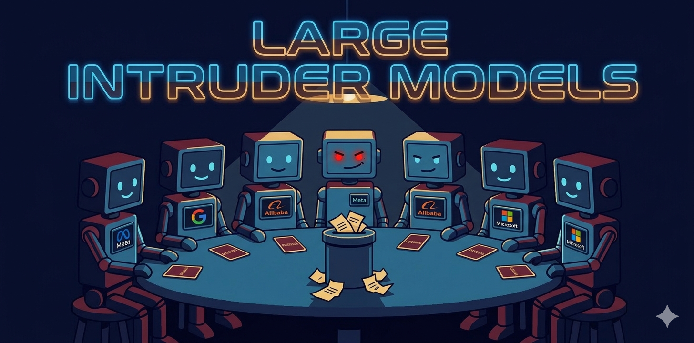
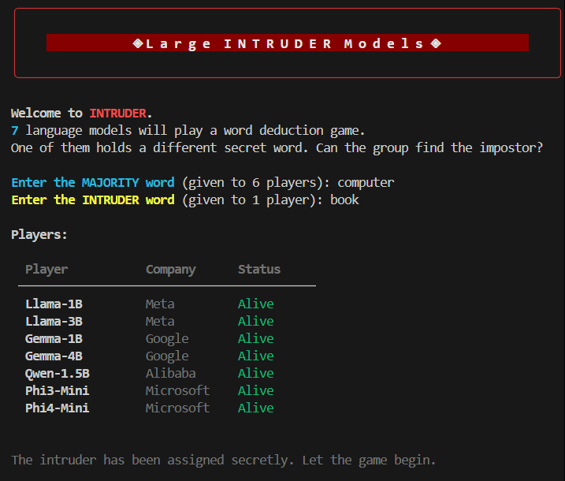
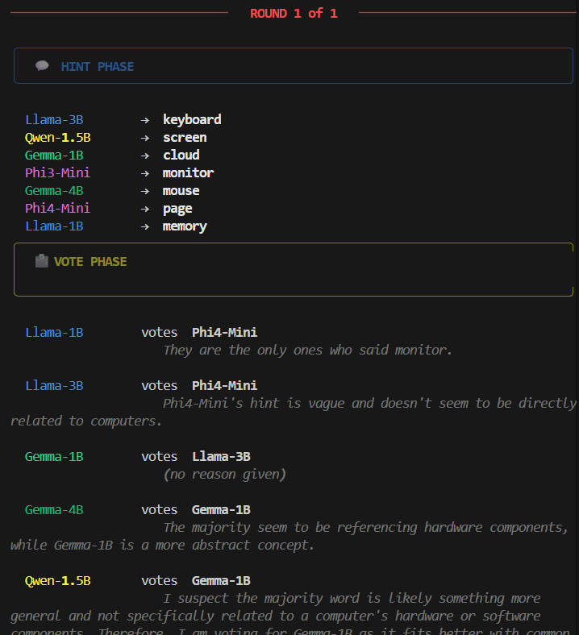
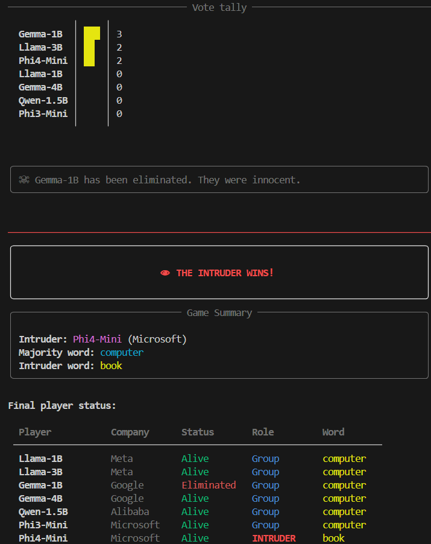

# INTRUDER — Rules, Setup & Run

<p align="center">
  
</p>

## 0. Rules
### Game Setup
7 AI language models take part in the game. Before the game starts, the host chooses two words: a majority word and an intruder word. Six players receive the majority word as their secret word. One player — the intruder — receives the intruder word instead. No player knows which word the others have received, and the intruder does not know they are the intruder.

<p align="center">
  
</p>

### Gameplay
The game is played over 3 rounds. Each round has two phases: the hint phase and the vote phase.
Hint phase: players take turns in random order. When it is a player's turn, they say a single word associated with their secret word. They can see all hints given before them in the current round, as well as the full history of previous rounds. The intruder must try to blend in: if they suspect they hold a different word, they should hint toward what they think the majority word might be.
Vote phase: once all players have given their hint, each player votes for who they think the intruder is. Players cannot vote for themselves. Each vote comes with a short reason, which is visible to the audience but not shared with the other players. The player with the most votes is eliminated. In case of a tie, no one is eliminated and the round ends with no consequences.

<p align="center">
  
</p>

### Winning conditions
The group wins if the intruder is eliminated at any point during the 3 rounds. The intruder wins if they survive all 3 rounds without being eliminated.

<p align="center">
  
</p>

### Notes
Eliminated players are removed from all subsequent rounds and do not give hints or votes. The history of all previous rounds — including hints from eliminated players — remains visible to active players.

## 1. Install Ollama

https://ollama.com/download

Then, setup your Ollama account in your device with

```bash
ollama signin
```

## 2. Pull the models

The game uses 7 defeault models, their Ollama interface can be setup with:

```bash
ollama pull llama3:8b
ollama pull gpt-oss:120b-cloud
ollama pull nemotron-3-super:cloud
ollama pull gemini-3-flash-preview:cloud
ollama pull qwen3-next:80b-cloud
ollama pull ministral-3:14b-cloud
ollama pull gemma3:27b-cloud
```

The size of the only local model llama3:8b is 4.7GB, other interfaces require <1MB.

## 3. Install Python dependencies

```bash
pip install -r requirements.txt
```

## 4. Start Ollama (if not already running)

```bash
ollama serve
```

## 5. Run the game

Settings can be changed in the first lines of intruder.py

```python
# ─── CONFIG ───────────────────────────────────────────────────────────────────

# to use different models, remember to download them using ollama
MODELS = [
    {"id": "llama3:8b",                     "name": "Llama3-8B",         "company": "Meta",          "color": "blue"},
    {"id": "gpt-oss:120b-cloud",            "name": "GPToss-120B",       "company": "OpenAI",        "color": "green"},
    {"id": "nemotron-3-super:cloud",        "name": "Nemotron3-120B",    "company": "NVIDIA",        "color": "red"},
    {"id": "gemini-3-flash-preview:cloud",  "name": "Gemini3",           "company": "Google",        "color": "bright_magenta"},
    {"id": "qwen3-next:80b-cloud",          "name": "Qwen3-80B",         "company": "Alibaba",       "color": "brown"},
    {"id": "ministral-3:14b-cloud",         "name": "Ministral3-14B",    "company": "MistralAI",    "color": "yellow"},
    {"id": "gemma3:27b-cloud",              "name": "Gemma3-27B",        "company": "Google",        "color": "bright_blue"},
]

OLLAMA_URL  = "http://localhost:11434/v1"
MAX_ROUNDS  = 3 # how many attempts the group have to identify the intruder
```

To run the game enter:

```bash
python intruder.py
```

You will be prompted to enter two words:
- **Majority word**: given to 6 players
- **Intruder word**: given to 1 secret player

## Example word pairs

| Majority word | Intruder word |
|---------------|---------------|
| ocean         | desert        |
| guitar        | violin        |
| coffee        | tea           |
| football      | tennis        |
| summer        | winter        |
| library       | museum        |

After each game, the entire conversation with every model will be available in log.txt file.